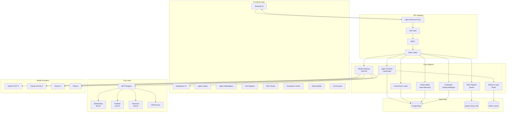

# MetaAI Platform — Enterprise AI Agent Platform

[](https://github.com/sam1064max/MetaAIPlatform/actions/workflows/ci-cd.yml)
[](https://www.python.org/)
[](LICENSE)
[](https://www.docker.com/)
[](https://langchain-ai.github.io/langgraph/)
[](https://fastapi.tiangolo.com/)
[](https://streamlit.io/)
[](https://github.com/sam1064max/MetaAIPlatform/releases)

A production-grade internal AI Foundry platform for financial services teams to **create, deploy, evaluate, monitor, and manage** AI agents without writing orchestration code.

---

## Architecture Overview



---

## Key Features

### Agent Studio
Low-code agent builder with drag-and-drop workflow composition. Define agents declaratively via YAML — no orchestration code required. Supports plan-and-execute, ReAct, and supervisor workflow patterns with configurable human-in-the-loop approval gates.

### Agent Marketplace
Reusable agent catalog spanning wealth advisory, compliance monitoring, customer service, risk assessment, and research. Share agents across teams with versioning, dependency management, and access controls.

### Tool Registry
MCP-based tool management system. Register, version, and govern tools independently from agents. Introspect tool schemas at runtime for dynamic validation. Built-in servers for market data, portfolio analytics, research, and CRM.

### RAG Platform
End-to-end knowledge base management: document ingestion, intelligent chunking, embedding generation, and hybrid search (dense + sparse). Tenant-isolated vector collections with metadata filtering and real-time updates.

### Evaluation Center
Automated evaluation pipeline with LLM-as-judge, RAG-specific metrics (faithfulness, relevance, precision), regression testing, and A/B comparison between models. Track performance over time with built-in dashboards.

### Observability
Full distributed tracing across agent calls, tool invocations, and LLM requests via OpenTelemetry. Metrics for latency, token usage, error rates, and cost. Span-level drill-down for debugging complex agent failures.

### Governance
Complete audit trail with cryptographic chaining. Approval workflows for high-risk actions. Policy-as-code for compliance rules. Automated reporting for SOC2, GDPR, and CCPA requirements.

---

## Quick Start

```bash
# Clone the repository
git clone https://github.com/sushantdev/MetaAIPlatform.git
cd MetaAIPlatform

# Configure environment
cp .env.example .env

# Start the platform
docker compose up -d

# Access
# Frontend: http://localhost:8501
# API: http://localhost:8000
# Docs: http://localhost:8000/docs
```

See [Setup Guide](docs/setup.md) for detailed instructions including local development setup.

---

## Screenshots

| Agent Studio | Dashboard | Evaluation Center |
|---|---|---|
|  |  |  |

*Screenshots coming soon — placeholder structure for documentation.*

---

## Technology Stack

| Layer | Technology | Purpose |
|-------|-----------|---------|
| **Frontend** | Streamlit | Unified Python-native UI framework |
| **API Gateway** | Nginx | Reverse proxy, rate limiting, TLS termination |
| **Auth** | JWT + RBAC | Token-based authentication, role-based access control |
| **Agent Runtime** | LangGraph | Declarative state machine orchestration for agents |
| **Model Gateway** | LiteLLM | Unified interface across LLM providers |
| **RAG** | Qdrant | Self-hosted vector database for semantic search |
| **Memory** | Redis | Session state, caching, pub/sub |
| **Evaluation** | DeepEval / Ragas | Automated LLM evaluation pipeline |
| **Observability** | OpenTelemetry | Distributed tracing, metrics, logging |
| **Database** | PostgreSQL | Operational data, audit logs, evaluation results |
| **Tool Protocol** | MCP | Standardized tool definition and invocation |
| **Container** | Docker / Docker Compose | Development and production deployment |

---

## Project Structure

```
MetaAIPlatform/
├── backend/
│   ├── main.py                  # FastAPI application entry point
│   ├── requirements.txt         # Python dependencies
│   ├── core/
│   │   ├── config.py            # Environment configuration
│   │   ├── security.py          # JWT auth, RBAC enforcement
│   │   └── dependencies.py      # FastAPI dependency injection
│   ├── agents/                  # Agent runtime integration
│   │   ├── runtime.py           # LangGraph runtime wrapper
│   │   ├── registry.py          # Agent registry and lifecycle
│   │   └── workflows/           # Workflow pattern implementations
│   ├── models/                  # Model gateway integration
│   │   ├── gateway.py           # LiteLLM wrapper
│   │   └── providers.py         # Provider-specific configs
│   ├── rag/                     # RAG pipeline
│   │   ├── pipeline.py          # Document processing pipeline
│   │   ├── embeddings.py        # Embedding generation
│   │   └── retriever.py         # Hybrid search implementation
│   ├── tools/                   # MCP tool definitions
│   │   ├── registry.py          # Tool discovery and validation
│   │   └── servers/             # MCP server implementations
│   ├── evaluation/              # Evaluation pipeline
│   │   ├── runner.py            # Test execution engine
│   │   └── metrics/             # Custom metric implementations
│   ├── governance/              # Audit and compliance
│   │   ├── audit.py             # Immutable audit logging
│   │   └── policies.py          # Policy-as-code engine
│   └── api/                     # REST API routes
│       ├── v1/
│       └── v2/
├── frontend/
│   ├── app.py                   # Streamlit application
│   ├── requirements.txt         # Frontend dependencies
│   ├── pages/
│   │   ├── dashboard.py
│   │   ├── agent_studio.py
│   │   ├── marketplace.py
│   │   ├── tool_registry.py
│   │   ├── rag_studio.py
│   │   ├── evaluation.py
│   │   ├── observability.py
│   │   └── governance.py
│   └── components/              # Reusable Streamlit components
├── examples/
│   ├── agents/
│   │   ├── wealth-advisor.yaml
│   │   ├── customer-service.yaml
│   │   ├── research-agent.yaml
│   │   ├── compliance-agent.yaml
│   │   └── portfolio-risk.yaml
│   └── tools/
│       ├── market_data_tool.yaml
│       └── portfolio_analyzer.yaml
├── docs/
│   ├── architecture.md          # Architecture deep-dive
│   ├── setup.md                 # Setup and deployment guide
│   └── assets/
│       └── screenshots/         # Documentation screenshots
├── deployment/
│   ├── docker-compose.yml       # Multi-service orchestration
│   ├── Dockerfile               # Application container build
│   └── scripts/
│       └── deploy.sh            # Production deployment script
├── tests/
│   ├── backend/
│   │   ├── test_agents.py
│   │   ├── test_tools.py
│   │   ├── test_rag.py
│   │   └── test_evaluation.py
│   └── frontend/
├── .env.example                 # Environment variable template
└── README.md                    # This file
```

---

## CI/CD Pipeline

```
Commit ─► Lint & Format ─► Unit Tests ─► Integration Tests ─► Security Scan ─► Build Images ─► Deploy Staging ─► E2E Tests ─► Deploy Production
```

| Stage | Tools | Description |
|-------|-------|-------------|
| **Lint & Format** | Ruff, Black, mypy | Static analysis, type checking, consistent formatting |
| **Unit Tests** | pytest | Component-level tests with mocked dependencies |
| **Integration Tests** | pytest + Docker | Service-level tests against real dependencies |
| **Security Scan** | Bandit, Trivy | SAST, dependency vulnerability scanning |
| **Build Images** | Docker BuildKit | Multi-stage container builds with caching |
| **Deploy Staging** | Docker Compose | Automated deployment to staging environment |
| **E2E Tests** | Playwright | Browser-level tests for Streamlit UI |
| **Deploy Production** | Docker Compose + Blue/Green | Zero-downtime production deployment |

---

## Deployment

### Docker (Recommended)

```bash
docker compose -f deployment/docker-compose.yml up -d
```

### Manual

```bash
python -m venv venv
source venv/bin/activate
pip install -r backend/requirements.txt
pip install -r frontend/requirements.txt
uvicorn backend.main:app --reload --port 8000 &
streamlit run frontend/app.py --server.port=8501
```

### Production Considerations

- Use **PostgreSQL** with read replicas and PgBouncer connection pooling
- Deploy **Redis Cluster** for high-availability session storage
- Run **Qdrant** with sharding for multi-tenant isolation
- Configure **Nginx** with upstream health checks and rate limiting
- Set up **Prometheus + Grafana** for production monitoring
- Use **HashiCorp Vault** or **AWS Secrets Manager** for API key management
- Enable **WAF** for external-facing deployments

---

## License

This project is licensed under the MIT License — see the [LICENSE](LICENSE) file for details.
