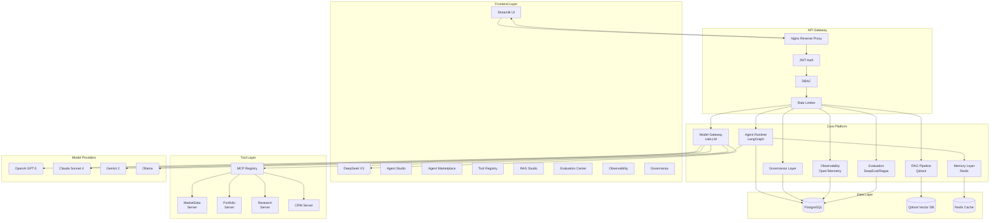

# Architecture Overview

## Platform Architecture Diagram



## Overview

MetaAI Platform is an internal AI Foundry purpose-built for financial services. It enables teams to create, deploy, evaluate, monitor, and govern AI agents without writing orchestration code. The platform follows a layered architecture ensuring separation of concerns, security at every boundary, and enterprise-grade scalability.

## Layer Descriptions

### Frontend Layer

The frontend is built with Streamlit, providing a unified interface for all platform capabilities:

| Component | Description |
|-----------|-------------|
| **Dashboard** | Central monitoring view showing agent health, performance metrics, and system status |
| **Agent Studio** | Low-code drag-and-drop agent builder for composing workflows without orchestration code |
| **Agent Marketplace** | Catalog of pre-built, reusable agents across domains (wealth advisory, compliance, research) |
| **Tool Registry** | Interface for registering and managing MCP-based tools with versioning and access control |
| **RAG Studio** | Knowledge base management with document ingestion, chunking, embedding, and retrieval tuning |
| **Evaluation Center** | Automated evaluation pipeline with configurable metrics, datasets, and regression tracking |
| **Observability** | Full tracing, logging, and monitoring powered by OpenTelemetry with span-level drill-down |
| **Governance** | Complete audit trail, approval workflows, policy management, and compliance reporting |

### API Gateway

All traffic routes through Nginx, which provides:

- **Rate Limiting** - Per-user and per-endpoint rate limits to prevent abuse and ensure fair resource allocation
- **JWT Authentication** - Token-based auth with refresh token rotation and session management
- **RBAC** - Fine-grained role-based access control at endpoint level, configurable via governance policies

**Design decision**: Placing auth and rate limiting at the gateway (rather than per-service) centralizes security policy and reduces duplication. The trade-off is that the gateway becomes a potential bottleneck, mitigated by Nginx's event-driven architecture and horizontal scaling.

### Core Platform

The heart of the system, composed of seven tightly integrated services:

#### Agent Runtime (LangGraph)

Agents are defined declaratively as state machines using LangGraph. Each agent specifies a workflow type (plan-and-execute, react, supervisor) and the runtime handles orchestration, tool calling, memory injection, and human-in-the-loop approval gates.

**Key capabilities:**
- Multi-agent orchestration with supervisor/sub-agent patterns
- Streaming responses for real-time UX
- Human-in-the-loop approval workflow with configurable timeout
- Parallel vs sequential execution modes
- Iteration limits with graceful degradation

#### Model Gateway (LiteLLM)

A unified LLM interface that normalizes API calls across providers. Provides:
- Provider-agnostic API (single interface for OpenAI, Anthropic, Google, DeepSeek, Ollama)
- Automatic fallback and retry logic
- Cost tracking per-model and per-agent
- Prompt caching and response caching
- Token budgeting and usage limits

**Design decision**: LiteLLM was chosen over direct API calls because it abstracts provider-specific SDK differences, simplifies model swapping, and provides built-in observability. The trade-off is dependency on a third-party library, which is mitigated by pinning versions and maintaining a fallback provider.

#### RAG Pipeline (Qdrant)

Enterprise RAG pipeline with:
- Document ingestion pipeline (parse, chunk, embed, index)
- Hybrid search (dense + sparse vectors with configurable weighting)
- Metadata filtering for tenant isolation
- Real-time embedding updates via change data capture

**Design decision**: Qdrant was selected over Pinecone/Weaviate for self-hosted deployment (data sovereignty requirement in financial services) and superior filtering performance at scale.

#### Memory Layer (Redis)

Session and conversation memory stored in Redis:
- Short-term conversation history with configurable TTL
- Long-term user preferences and profile data
- Distributed caching for tool responses and LLM completions
- Pub/sub for real-time agent communication

#### Evaluation (DeepEval / Ragas)

Automated evaluation pipeline supporting:
- LLM-as-judge evaluation with configurable criteria
- RAG-specific metrics (faithfulness, relevance, precision)
- Regression testing on evaluation datasets
- A/B comparison between model versions
- Custom metric definition

#### Observability (OpenTelemetry)

Full observability with:
- Distributed tracing across agent calls, tool invocations, and LLM requests
- Metrics collection (latency, token usage, error rates, cost)
- Structured logging with correlation IDs
- Span-level drill-down for debugging

#### Governance Layer

Every action is logged to PostgreSQL for audit. Features:
- Immutable audit trail with cryptographic chaining
- Approval workflows for high-risk actions
- Policy-as-code for compliance rules
- Automated compliance reporting (SOC2, GDPR, CCPA)

### Tool Layer

Tools are MCP (Model Context Protocol) servers that agents invoke to perform actions. The MCP Registry manages tool discovery, versioning, authentication, and access control.

**Implemented MCP servers:**

| Server | Description |
|--------|-------------|
| **MarketData Server** | Real-time quotes, historical prices, fundamentals via market data provider APIs |
| **Portfolio Server** | Portfolio analytics engine computing risk metrics, performance attribution, and what-if scenarios |
| **Research Server** | Financial research aggregation from multiple sources with citation tracking |
| **CRM Server** | Customer relationship data access for personalized service and KYC checks |

**Design decision**: MCP was chosen over REST/gRPC for tool definitions because it provides a standardized schema for tool parameters, returns, and authentication that the runtime can introspect and validate dynamically.

### Data Layer

| Database | Purpose | Technology Rationale |
|----------|---------|---------------------|
| **PostgreSQL** | Primary operational database for agent state, user data, audit logs, evaluation results | ACID compliance required for financial audit trails; well-understood operational characteristics |
| **Qdrant** | Vector database for RAG embeddings | Self-hosted, high-performance ANN search, metadata filtering at scale |
| **Redis** | Cache, session store, pub/sub, real-time memory | In-memory speed for latency-sensitive agent conversations and tool response caching |

### Model Providers

Multi-provider strategy for redundancy and cost optimization:

| Provider | Models | Use Case |
|----------|--------|----------|
| OpenAI | GPT-5 | Complex reasoning, research analysis, report generation |
| Anthropic | Claude Sonnet 4 | Customer service (safety-aligned), compliance (lower temperature) |
| Google | Gemini 2 | Multimodal analysis, document processing |
| DeepSeek | V3 | Cost-effective inference for high-volume, low-complexity tasks |
| Ollama | Local models | Offline development, sensitive data processing, air-gapped deployments |

**Design decision**: Multi-provider approach prevents vendor lock-in and allows routing each workload to the most cost-effective model. Trade-off: increased operational complexity, managed by LiteLLM's unified interface.

## Security Architecture

```
Internet ──► WAF ──► Nginx (TLS) ──► Auth (JWT + RBAC) ──► Service Mesh ──► Services
```

- All external traffic terminates TLS at Nginx
- Authentication is JWT-based with 15-minute access tokens and 7-day refresh tokens
- Authorization uses RBAC with roles: Viewer, Operator, Agent Developer, Admin, Super Admin
- Service-to-service communication within the mesh uses mTLS
- All audit-relevant operations are logged immutably to PostgreSQL
- PII data is encrypted at rest (AES-256) and in transit (TLS 1.3)
- API keys for external model providers are stored in a vault (HashiCorp Vault or AWS Secrets Manager)

## Scalability Considerations

| Component | Strategy | Notes |
|-----------|----------|-------|
| **Nginx** | Horizontal scaling behind load balancer | Stateless, scales linearly |
| **Agent Runtime** | Horizontal pod scaling per agent type | State stored in Redis, stateless runtime |
| **Model Gateway** | Connection pooling, request queuing | Avoids provider rate limits |
| **Qdrant** | Sharding by tenant/collection | Handles 10B+ vectors |
| **Redis** | Cluster mode with replication | Sub-millisecond latency at scale |
| **PostgreSQL** | Read replicas, connection pooling | PgBouncer for connection management |

## Trade-offs Summary

| Decision | Rationale | Trade-off |
|----------|-----------|-----------|
| LangGraph over custom runtime | Battle-tested state machine orchestration | Learning curve, dependency on framework evolution |
| LiteLLM over direct API | Unified provider interface, built-in fallback | Third-party dependency, abstraction overhead |
| Qdrant over managed vector DB | Data sovereignty for financial compliance | Operational overhead of self-hosting |
| MCP over REST/gRPC | Self-describing tools with runtime introspection | Newer protocol, smaller ecosystem |
| Streamlit over React/Vue | Rapid development, Python-native data stack | Limited UI customization, less suitable for consumer-facing apps |
